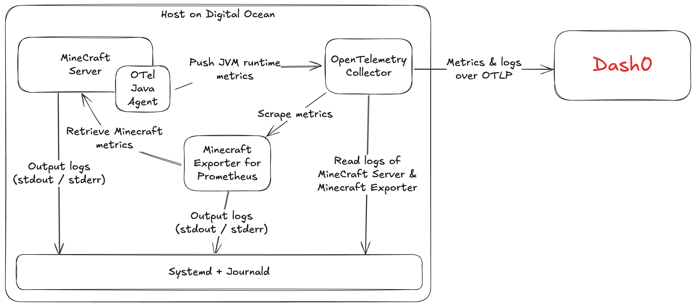
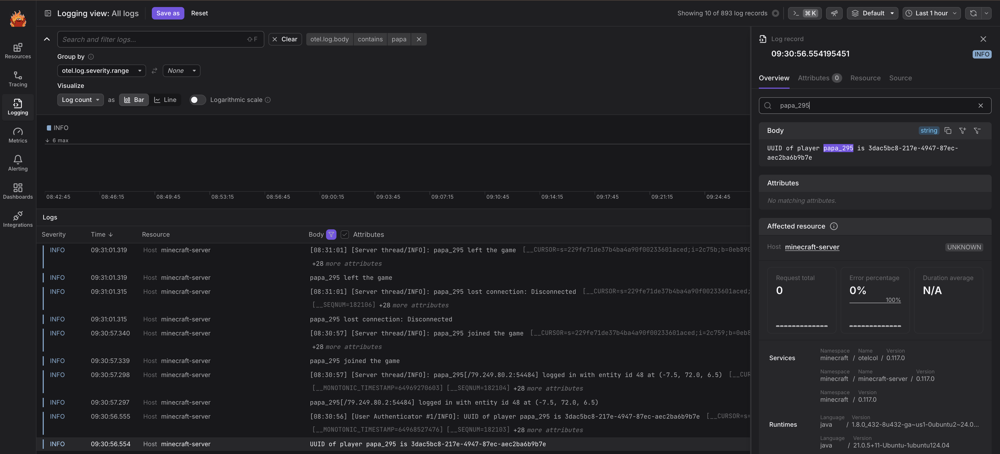

# Minecraft server

This is an example of how to monitor a vanilla Minecraft server with [OpenTelemetry](https://opentelemetry.io/) and [Dash0](https://www.dash0.com/).

The overview of the setup as follows:



## Infrastructure

I did this setup on a [Digital Ocean droplet](https://www.digitalocean.com/), for no better reason than I wanted to try it.
The setup is pretty manually crafted, and probably you should use something more automated for your own server.
One option that caught my eye is [`minectl`](https://github.com/dirien/minectl), but I did not try it because I was missing the thrill of crafting Systemd units and the like.
I did, however, end up using the Prometheus exporter from the `minectl` project.

## Monitoring

We are going to use two OpenTelemetry components: the OpenTelemetry Java Agent will be added to the Minecraft server itself to collect runtime metrics, and the OpenTelemetry Collector will receive data from the OpenTelemetry Java Agent, retrieve metrics from the [Minecraft Prometheus Exporter](#minecraft-prometheus-exporter), collect logs from Systemd, and send it all to Dash0.

### OpenTelemetry Java Agent

The OpenTelemetry Java Agent is a JAR file that adds an OpenTelemetry SDK and autoinstrumentations to applications running on the Java Virtual Machine, like a vanilla Minecraft server.
In our case, we are interested in the JVM runtime metrics.

```shell
mkdir -p /opt/otel/java
curl -L https://github.com/open-telemetry/opentelemetry-java-instrumentation/releases/download/v2.15.0/opentelemetry-javaagent.jar -o /opt/otel/java/opentelemetry-javaagent.jar
```

### Minecraft Prometheus Exporter

Copy the [`./droplet/usr/lib/systemd/system/minecraft-exporter.service`](./droplet/usr/lib/systemd/system/minecraft-server.service) file to `/usr/lib/systemd/system/minecraft-exporter.service`.

```shell
MINECRAFT_EXPORTER_VERSION=0.21.0
ARCH=amd64
curl -sSL https://github.com/dirien/minecraft-prometheus-exporter/releases/download/v$MINECRAFT_EXPORTER_VERSION/minecraft-exporter_$MINECRAFT_EXPORTER_VERSION.linux-$ARCH.tar.gz | tar -xz
cp minecraft-exporter /home/minecraft
chown minecraft:minecraft /home/minecraft/minecraft-exporter
systemctl start minecraft-exporter.service
systemctl enable minecraft-exporter.service
```

### OpenTelemetry Collector

The OpenTelemetry Collector "ties the monitoring together", receiving data from the OpenTelemetry Java Agent, retrieving metrics from the [Minecraft Prometheus Exporter](#minecraft-prometheus-exporter), collecting logs from Systemd, and sending it all to Dash0.

```shell
ARCH=amd64
cd /tmp/
curl -L https://github.com/open-telemetry/opentelemetry-collector-releases/releases/download/v0.124.1/otelcol-contrib_0.124.1_linux_$ARCH.deb -o otelcol-contrib_0.124.1.deb
dpkg -i otelcol-contrib_0.124.1.deb
sudo adduser otelcol-contrib systemd-journal # This allows the collector to read logs from the other components
```

Copy the [`droplet/etc/otel-contrib/config.yaml`](./droplet/etc/otel-contrib/config.yaml) file to `/etc/otel-contrib/config.yaml`.

Edit the SystemD configuration [`./droplet/etc/otel-contrib/otelcol-contrib.conf`](./droplet/etc/otel-contrib/otelcol-contrib.conf) to add the Dash0 token and endpoint and copy it to `/etc/otel-contrib/otelcol-contrib.conf`.

Finally, start the OpenTelemetry Collector and mark it to start on startup:

```sh
systemctl start otelcol-contrib.service
systemctl enable otelcol-contrib.service
```

## Minecraft server

### Java Virtual Machine

Install a recent Java Virtual Machine:

```shell
sudo apt install -y openjdk-21-jdk
```

## User setup

Download the Minecraft server (get the latest server from https://www.minecraft.net/en-us/download/server):

```shell
sudo adduser minecraft
sudo su minecraft
cd ~
curl -L https://piston-data.mojang.com/v1/objects/4707d00eb834b446575d89a61a11b5d548d8c001/server.jar -o server.jar
echo 'eula=true' > eula.txt
```

### Server configuration

Copy the [`./droplet/home/minecraft/server.properties`](./droplet/home/minecraft/server.properties) file to `/home/minecraft/server.properties`.

**Note:** The properties above assume you will set up an allow list, which you really should if you plan to expose the server on the internet.
The format of the `whitelist.json` file, which has the following structure:

```json
[
  {
    "uuid": "3dac5bc8-217e-4947-87ec-aec2ba6b9b7e",
    "name": "papa_295"
  }
]
```

(This above is my UUID. Add me to your servers at your own risk. Also, I was not at my creative best when I picked the username.)

To get the user's UUIDs you want to add, one way is to let them try to log in, and then the username and UUID will be logged and you can see it in Dash0:



Alternatively, you can find the UUID of players based on their usernames using services like [MinecraftUUID](https://minecraftuuid.com/player/papa_295).

### Automate the Minecraft server startup

Copy the [`./droplet/usr/lib/systemd/system/minecraft-server.service`](./droplet/usr/lib/systemd/system/minecraft-server.service) file to `/usr/lib/systemd/system/minecraft-server.service`.

Mark the Systemd unit to start on startup:

```shell
ln -s /usr/lib/systemd/system/minecraft-server.service /etc/systemd/system/multi-user.target.wants/minecraft-server.service
```

**Note:** You should customize the values of the `-Xmx` and `-Xmx` flags to set the size of the heap for the server's Java Virtual Machine.
I am running the server on a VM with 4GB of memory, which runs additionally only the OpenTelemetry collector and the Mineracft Exporter, so I set the heap to 3GB.

Start the Minecraft server and mark it to start on startup:

```shell
systemctl start minecraft-server.service
systemctl enable minecraft-server.service
```

Check the status with:

```shell
systemctl status minecraft-server
● minecraft-server.service - Minecraft Server
     Loaded: loaded (/usr/lib/systemd/system/minecraft-server.service; enabled; preset: enabled)
     Active: active (running) since Mon 2025-05-07 08:33:16 UTC; 15min ago
   Main PID: 33608 (java)
      Tasks: 35 (limit: 4658)
     Memory: 793.2M (peak: 858.0M)
        CPU: 55.696s
     CGroup: /system.slice/minecraft-server.service
             └─33608 /usr/bin/java -XX:+UseG1GC -Xmx3G -Xmx3G -XX:UseSSE=3 -XX:+UnlockExperimentalVMOptions -XX:G1NewSizePercent=20 -XX:G1ReservePercent=20 -XX:MaxGCPauseMillis=50 -XX:G1HeapRegion>

May 7 08:33:43 minecraft-server java[33608]: [08:33:43] [Worker-Main-1/INFO]: Preparing spawn area: 0%
May 7 08:33:43 minecraft-server java[33608]: [08:33:43] [Worker-Main-1/INFO]: Preparing spawn area: 0%
May 7 08:33:43 minecraft-server java[33608]: [08:33:43] [Worker-Main-1/INFO]: Preparing spawn area: 0%
May 7 08:33:43 minecraft-server java[33608]: [08:33:43] [Worker-Main-1/INFO]: Preparing spawn area: 0%
May 7 08:33:43 minecraft-server java[33608]: [08:33:43] [Worker-Main-1/INFO]: Preparing spawn area: 0%
May 7 08:33:43 minecraft-server java[33608]: [08:33:43] [Worker-Main-1/INFO]: Preparing spawn area: 0%
May 7 08:33:43 minecraft-server java[33608]: [08:33:43] [Worker-Main-1/INFO]: Preparing spawn area: 0%
May 7 08:33:43 minecraft-server java[33608]: [08:33:43] [Server thread/INFO]: Time elapsed: 8588 ms
May 7 08:33:43 minecraft-server java[33608]: [08:33:43] [Server thread/INFO]: Done (9.249s)! For help, type "help"
May 7 08:34:43 minecraft-server java[33608]: [08:34:43] [Server thread/INFO]: Server empty for 60 seconds, pausing
```
